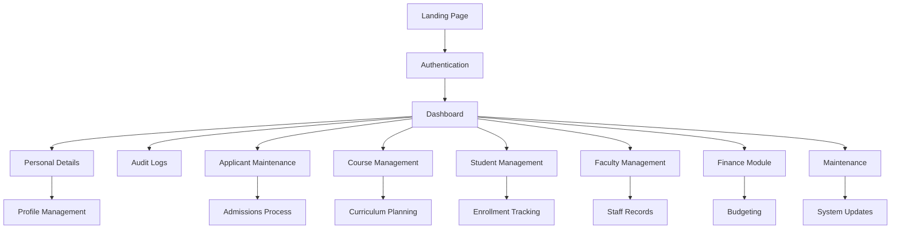

# ERP Visualization of West Coast College Admin System

This document visualizes the Enterprise Resource Planning (ERP) structure of the West Coast College admin system.

## System Overview

The system is a web-based admin dashboard for managing college operations, including student admissions, faculty management, course administration, and system maintenance.

## ERP Modules

## Module Descriptions

- **Landing Page**: Public-facing page with college information and application options
- **Authentication**: Login system for admin access
- **Dashboard**: Central hub for all admin functions
- **Personal Details**: User profile management
- **Audit Logs**: System activity tracking
- **Applicant Maintenance**: Applicant management and processing
- **Course Management**: Academic program administration
- **Student Management**: Student records and enrollment
- **Faculty Management**: Staff and faculty administration
- **Finance**: Budget and financial management
- **Maintenance**: System maintenance and updates

This visualization shows the interconnected nature of the ERP system, with the Dashboard as the central node connecting all modules.
