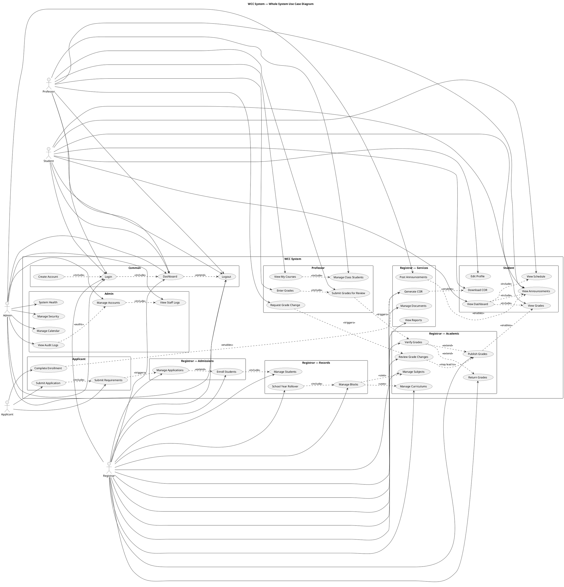

# WCC System - Complete Use Case Diagram

Single whole-system use case diagram for the WCC system.

## Reading this diagram

- **Left side actors:** Admin, Registrar, Applicant
- **Right side actors:** Professor, Student
- **Center use cases:** All features grouped by portal
- **Solid lines:** Which actor can access which feature
- **Dashed lines:** relationships between use cases
  - `<<include>>` = one feature always needs another
  - `<<extend>>` = one feature may lead to another
  - `<<triggers>>` = one action starts another
  - `<<enables>>` = one action unlocks another
