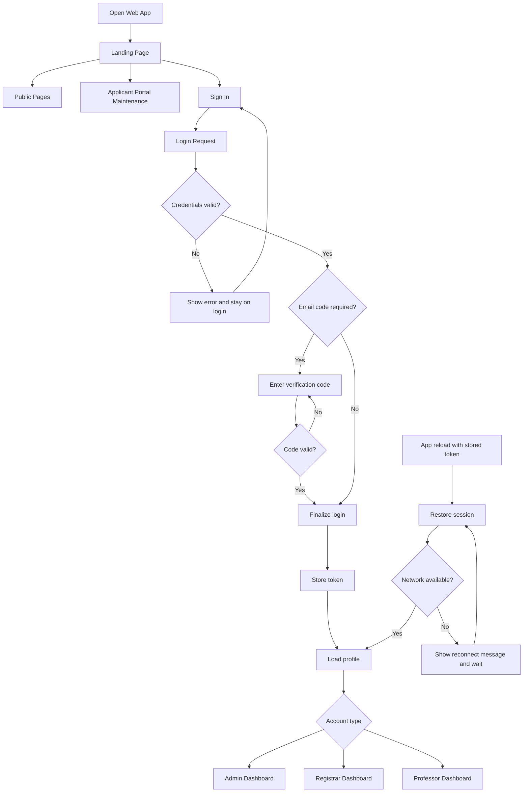
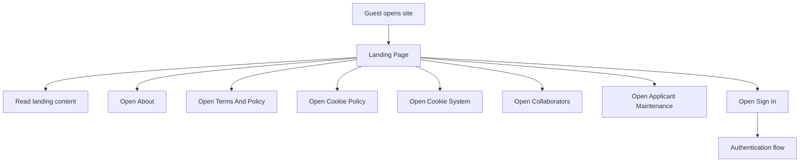
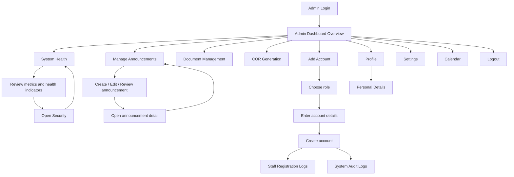
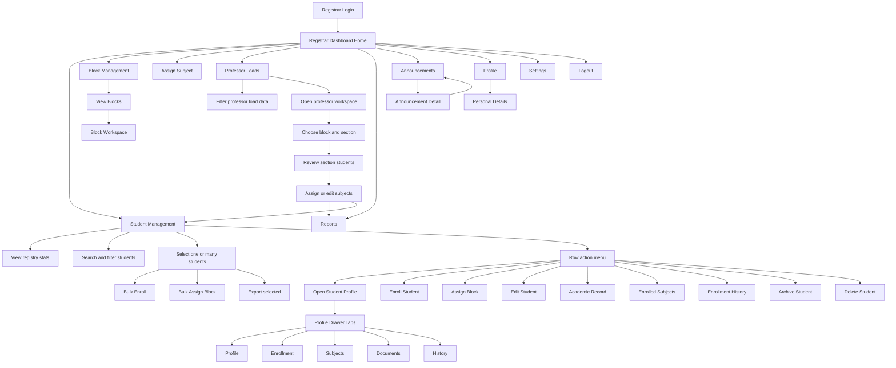
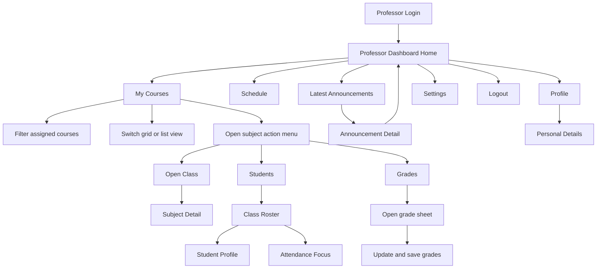

# Detailed Role Flowcharts And Process Map

This document expands the role documentation from simple dashboard navigation into feature-level flows and operational processes.

Scope notes:
- The authenticated web roles currently routed by the app are `admin`, `registrar`, and `professor`.
- The public side includes a guest/visitor flow and an applicant-maintenance branch.
- The current web app does not route a separate logged-in `student` dashboard after authentication.
- These diagrams are based on the current routing and feature entry points in `admin/src/App.tsx`, `admin/src/pages/Dashboard.tsx`, `admin/src/pages/RegistrarDashboard.tsx`, `admin/src/pages/ProfessorDashboard.tsx`, `admin/src/components/StudentManagement.tsx`, `admin/src/components/RegistrarCourseManagement.tsx`, and `admin/src/components/RegistrarCourseWorkspace.tsx`.

## 1. System Authentication And Routing

### Core behavior
- A guest user starts on the landing page.
- Public pages can be opened without authentication.
- Sign-in can return either direct login success or an email verification challenge.
- After successful authentication, the app routes users by `accountType`.
- Session restoration runs on app boot when a stored token exists.
- Network interruption during session restore triggers automatic retry and reconnect messaging.

### Flowchart

## 2. Public / Guest Role

### Main features
- Open landing page content and hero sections.
- Open About page.
- Open Terms and Policy page.
- Open Cookie Policy page.
- Open Cookie System page.
- Open Collaborators page.
- Open Applicant Portal maintenance page.
- Open sign-in flow.

### Public process
1. User opens the site and lands on the public landing page.
2. User either explores public content or proceeds to sign in.
3. If the user selects applicant access, the current system sends them to the maintenance screen.
4. If the user signs in successfully, control transfers to the appropriate authenticated dashboard.

### Detailed guest flowchart

## 3. Admin Role

### Role objective
The admin role manages platform-wide administration, staff account provisioning, system monitoring, logs, document workflows, announcements, and security oversight.

### Main features
- Dashboard overview with metrics and registration log snapshots.
- System Health monitoring.
- Security review from the System Health workflow.
- Manage Announcements.
- Announcement detail review.
- Document Management.
- COR Generation.
- Add Account for staff accounts.
- Staff Registration Logs.
- System Audit Logs.
- Profile management.
- Personal details subview.
- Settings management.
- Calendar view.
- Logout.

### Admin process groups

#### A. Account administration
1. Admin opens `Add Account`.
2. Admin selects the target role.
3. Admin fills account details and submits.
4. New staff account becomes available for login and tracking.
5. Admin can review creation activity in Staff Registration Logs and Audit Logs.

#### B. Announcement and document control
1. Admin opens `Manage Announcements`.
2. Admin creates, updates, or reviews announcement records.
3. Admin can open a single announcement detail view for review.
4. Admin can also manage records through `Document Management` and `COR Generation`.

#### C. Monitoring and security
1. Admin opens `System Health`.
2. Admin reviews operational metrics.
3. Admin can pivot into `Security`.
4. Admin investigates suspicious activity, threats, or system alerts.
5. Admin returns to System Health or Dashboard after review.

### Detailed admin flowchart

## 4. Registrar Role

### Role objective
The registrar role manages student records, lifecycle changes, enrollment control, block assignment, professor loads, section subject assignment, and reports.

### Main features
- Registrar dashboard home with quick actions and announcement preview.
- Student Management workspace.
- Student profile drawer with tabs:
  - Profile
  - Enrollment
  - Subjects
  - Documents
  - History
- Student registry search and filters.
- Student lifecycle updates.
- Student add/edit flows.
- Single-student and bulk enrollment workflows.
- Single-student and bulk block assignment workflows.
- Student archive and delete actions.
- Student CSV export.
- Block Management.
- View Blocks.
- Block Workspace.
- Assign Subject.
- Professor Loads management.
- Professor Load Workspace.
- Reports.
- Announcements and announcement detail.
- Profile and personal details.
- Settings.
- Logout.

### Registrar process groups

#### A. Student registry and lifecycle operations
1. Registrar opens `Student Management`.
2. Registrar reviews summary cards for total, pending, active, inactive, and graduating students.
3. Registrar filters the registry by search term, course, year level, lifecycle, or block assignment state.
4. Registrar can select individual or visible students for bulk operations.
5. Registrar updates lifecycle status directly in the table or from specific actions.
6. Registrar can archive, delete, or export selected student records.

#### B. Student detail workflow
1. Registrar opens a student row or the row action menu.
2. Registrar opens the student profile drawer.
3. Registrar navigates across tabs:
   - Profile for personal and academic snapshot
   - Enrollment for current term status
   - Subjects for enrolled subject list
   - Documents for supporting records
   - History for lifecycle/enrollment history
4. Registrar can branch into edit, enroll, or assign block actions from the profile header.

#### C. Enrollment and block assignment workflow
1. Registrar chooses one or more students.
2. System validates that grouped students share compatible course and year-level context for bulk actions.
3. Registrar opens enrollment or block assignment workflow.
4. Registrar selects a valid block group and available section where needed.
5. Registrar completes the action.
6. Student registry refreshes and status cards update.

#### D. Professor load and section assignment workflow
1. Registrar opens `Professor Loads`.
2. Registrar reviews professor totals, assigned subjects, sections covered, and students covered.
3. Registrar filters by search, course, semester, school year, and sort order.
4. Registrar opens a professor workspace.
5. Registrar selects a block group and section.
6. Registrar reviews students in the selected section.
7. Registrar assigns or edits subject schedule, instructor, and room.
8. Registrar refreshes workspace data and can continue to Reports or Student Management.

### Detailed registrar flowchart

## 5. Professor Role

### Role objective
The professor role manages assigned courses, subject detail views, class rosters, attendance-focused student views, grading, schedules, and profile/settings maintenance.

### Main features
- Professor dashboard home.
- Reconnect-aware data loading for announcements and course data.
- My Courses management.
- Subject detail page.
- Students / roster management.
- Attendance-focused student view.
- Grades management.
- Schedule management.
- Dashboard announcement detail flow.
- Profile.
- Personal details.
- Settings.
- Logout.

### Professor process groups

#### A. Course review and class navigation
1. Professor opens `My Courses`.
2. Professor filters assigned classes by course, semester, school year, subject sort, and enrolled-only mode.
3. Professor switches between grid and list views.
4. Professor opens the action menu on a subject.
5. Professor chooses one of the main next steps:
   - Open Class
   - Students
   - Attendance
   - Grades

#### B. Student roster and attendance workflow
1. Professor opens `Students` from a class action.
2. System loads the selected class context.
3. Professor reviews the roster and student profile information.
4. Professor switches focus between student list and attendance mode.
5. Professor can inspect student-level academic context from the current class.

#### C. Grade management workflow
1. Professor opens `Grades`.
2. System loads the selected class or the current class context.
3. Professor reviews roster grade fields.
4. Professor updates current grades and related class records.
5. Professor saves updates and refreshes the assigned course data.

#### D. Schedule workflow
1. Professor opens `Schedule`.
2. System organizes assigned classes by schedule-related course data.
3. Professor reviews teaching schedule, rooms, and section timing.

### Detailed professor flowchart

## 6. Feature Matrix By Role

| Feature Area | Public / Guest | Admin | Registrar | Professor |
| --- | --- | --- | --- | --- |
| Landing and public pages | Yes | No | No | No |
| Sign in and session routing | Yes | Yes | Yes | Yes |
| Dashboard home | No | Yes | Yes | Yes |
| Profile and personal details | No | Yes | Yes | Yes |
| Settings | No | Yes | Yes | Yes |
| Announcements view | Public links only | Yes | Yes | Dashboard detail flow |
| Announcement detail | No | Yes | Yes | Yes |
| Add Account | No | Yes | No | No |
| Staff / audit logs | No | Yes | No | No |
| Document Management | No | Yes | No | No |
| COR Generation | No | Yes | Available route | No |
| System Health / Security | No | Yes | No | No |
| Student registry | No | No | Yes | No |
| Student profile drawer | No | No | Yes | No |
| Enrollment workflow | No | No | Yes | No |
| Block assignment workflow | No | No | Yes | No |
| Block management workspace | No | No | Yes | No |
| Professor load workspace | No | No | Yes | No |
| Reports | No | No | Yes | No |
| My Courses | No | No | No | Yes |
| Class roster / students | No | No | No | Yes |
| Attendance focus | No | No | No | Yes |
| Grade management | No | No | No | Yes |
| Schedule management | No | No | No | Yes |

## 7. Current Boundary Note

The current web app manages student records operationally, but it does not provide a separate student self-service dashboard after login. In the present implementation, student-facing academic records are surfaced through registrar and professor workflows instead of a direct student portal.
